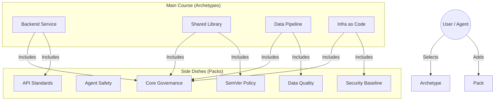

# 🍷 AAA Service Menu (Carte de la Gouvernance)

> **Role**: This is the Human-Readable Source of Truth.
> **Workflow**: You edit this Menu -> AAA compiles it to `registry.json` for Agents & CLI.

---

## 🍱 1. Archetypes (Project Types)
*Pick one as your foundation.*

| Archetype | Description | Includes Packs | Recommended Evals |
| :--- | :--- | :--- | :--- |
| **Backend Service** | API-first microservices requiring contract testing | `core-governance`, `api-standards` | `lint-openapi`, `check-health-endpoint` |
| **Shared Library** | Reusable code modules with versioning | `core-governance`, `semver-policy` | `test-coverage-90`, `check-changelog` |
| **Data Pipeline** | ETL/ELT jobs with schema validation | `core-governance`, `data-quality` | `validate-dbt-schema` |
| **Infra as Code** | Terraform/K8s manifests | `core-governance`, `security-baseline` | `trivy-scan`, `check-terraform-fmt` |

---

## 🥗 2. A la Carte Packs (Capabilities)
*Add these to enhance your project.*

### 🛡️ Agent Safety (`agent-safety`)
*prevents AI from going rogue*
- [x] **Sandbox**: Prevents file system access outside workspace
- [x] **Injection Guard**: Detects potential prompt injection attacks
- [x] **Firewall**: Blocks unauthorized network egress

### 🏛️ Core Governance (`core-governance`)
*The baseline requirement for all projects*
- [x] **Readme**: Enforces standard README structure
- [x] **Owners**: Validates CODEOWNERS existence
- [x] **Pinning**: Checks GitHub Workflow pinning

---

## 👨‍🍳 Chef's Notes (How AAA Translates This)
When you save this file, **AAA Compiler** performs:
1. **For AI Agents**: Generates `registry_index.v2.json` (The Protocol).
2. **For Humans**: Generates `aaa init` CLI Prompts (The Wizard).
